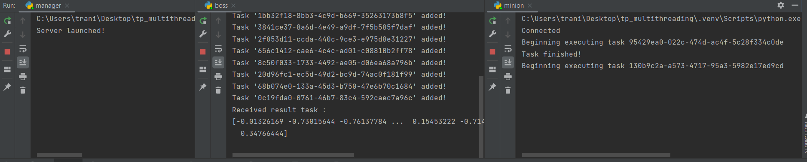
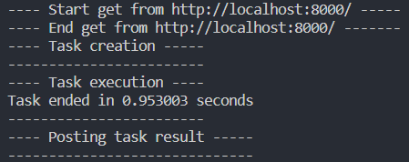
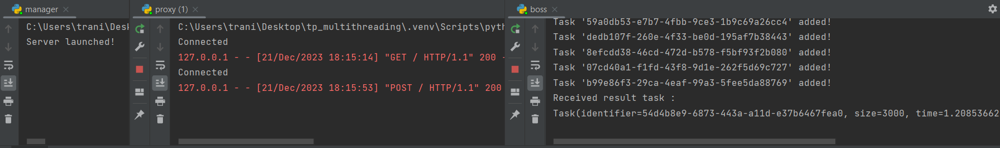

# TP Multithreading

## Introduction

Ce dépôt est un projet scolaire inscrit dans le module de multithreading de la 3ème année de l'UPSSITECH.

Les auteurs de ce projet sont Julian TRANI & Pauline JOBERT.

**DISCLAIMER** : 
- Ce projet a été réalisé sous Windows.
- Les commandes pour executer la partie C++ n'ont pas été testées, étant donné que nous avons utilisé une extension de VSCode.
- Nous avons implémenté des tests unitaires pour la partie Python mais pas la partie C++.

## Fonctionnement

### Partie Python

Pour lancer la partie Python, vous pouvez exécuter les fichiers dans l'ordre suivant :
- `manager.py`
- `proxy.py`
- `boss.py`
- `minion.py` 

Dès son lancement, le fichier `boss.py` va ajouter 15 tâches dans la file d'attente (paramètre modifiable directement dans le code).

Quant au `minion`, il va récupérer une tâche dans la `task_queue` afin de l'exécuter, puis renvoyer le résultat dans une `result_queue`.

Voici un exemple d'exécution :



### Partie C++

Le principe est de garder l'architecture logicielle Python, mais de ne pas réaliser la tâche avec un minion Python mais C++.
On veut envoyer les informations de tâche à un minion C++ via une requête http `GET`.
Le minion C++ vérifie de manière périodique si une tâche est disponible afin de la réaliser. 
Si c'est le cas, il récupère les données, réalise la tâche, et renvoie le résultat via une nouvelle requête http `POST`.

Pour cela, **assurez-vous que le `proxy` Python soit lancé** avant d'exécuter le code C++ avec les commandes suivantes :

```
cmake -B build -S .
cmake --build build
./build/low_level
```

Voici un exemple d'exécution du côté C++ :



Une fois l'exécution de la tâche terminée, cette tâche est renvoyée au manager via une requête `POST` (proxy).

Du côté du code Python, nous récupérons les informations sur l'exécution de la tâche :



## Comparaison Python/C++

L'objectif est de comparer la vitesse d'execution d'une tâche par un minion Python avec un minion C++.
Voici un tableau comparatif des différents tests réalisés.
**NB :** En C++, les tests sont réalisés en mode `RELEASE` afin d'obtenir de meilleures performances.

| Taille             |                3000                |
| :----------------- | :--------------------------------: |
| Python             | Task ended in en 0.3022408 seconds |
| C++ (Piv)        |  Task ended in en 10.0547 seconds  |
| C++ (Lu) 1 thread  |  Task ended in en 1.34219 seconds  |
| C++ (Lu) 2 threads | Task ended in en 0.884321 seconds  |
| C++ (Lu) 4 threads | Task ended in en 0.627631 seconds  |

On observe que le minion Python a une vitesse d'exécution plus rapide que le minion C++ grâce à NumPy.

