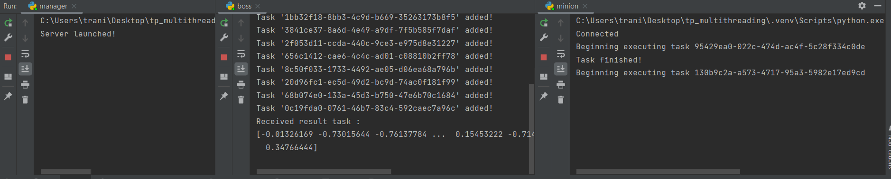

# TP multithreading

Julian TRANI & Pauline JOBERT 3A

#

# Run partie python

Pour lancer la partie python, vous devez exécuter le fichier `manager.py`, puis le `boss.py` et le `minion.py`

Voici un exemple d'exécution :

Poruquoi le projet existe ? => projet scolaire
Comment le projet fonctionne ? => scritps python / compiler c++
Résultats attendus => screen

Voici un tableau comparatif des différents tests réalisés.
NB : En cpp, les tests sont réalisés en mode `RELEASE`

| Size               |              3000               |
| :----------------- | :-----------------------------: |
| Python             | Task ended in 0.3022408 seconds |
| C++ (Piv)          |  Task ended in 10.0547 seconds  |
| C++ (Lu) 1 thread  |  Task ended in 1.34219 seconds  |
| C++ (Lu) 2 threads | Task ended in 0.884321 seconds  |
| C++ (Lu) 4 threads | Task ended in 0.627631 seconds  |
